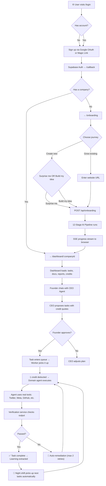
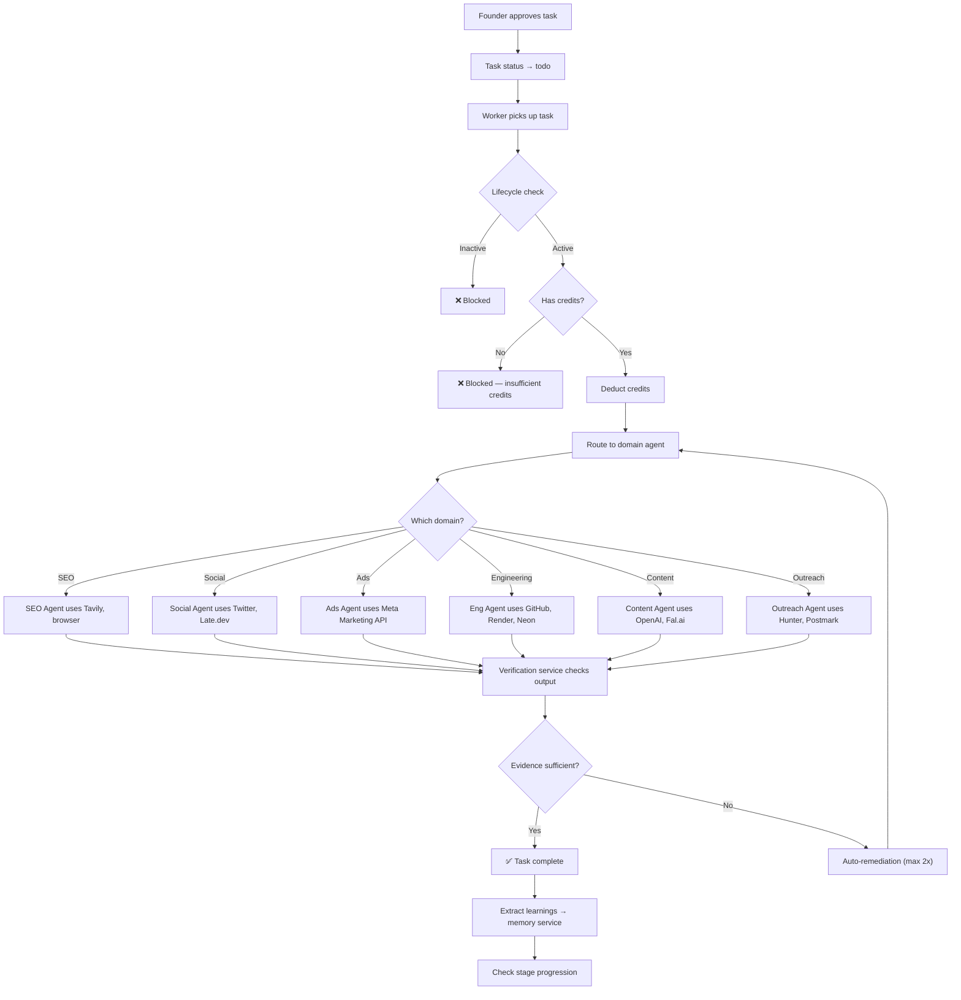
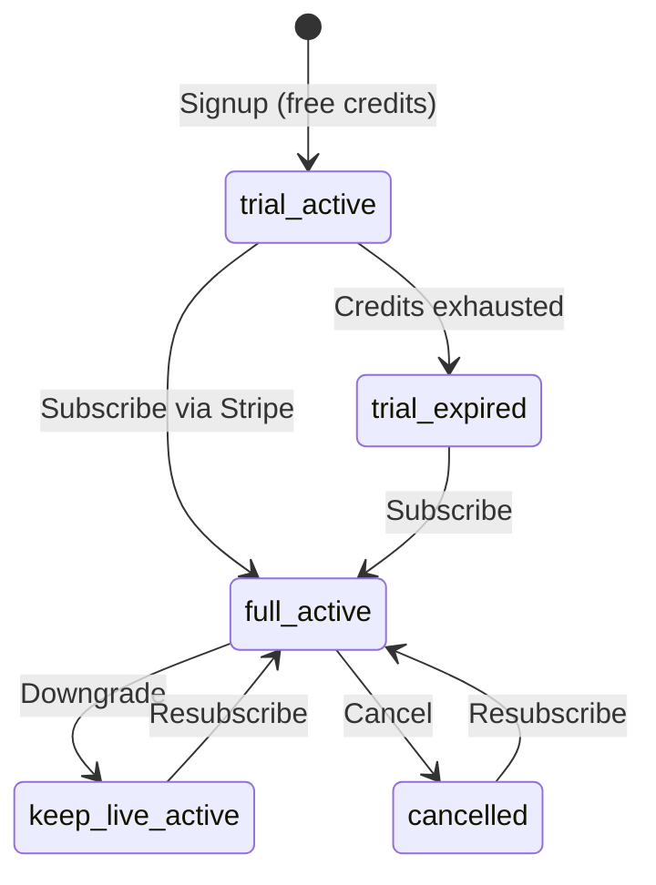

# Baljia AI — Complete User Flow

## High-Level Journey



---

## Stage-by-Stage Breakdown

### 1. Authentication (`/login`)

| What | How | Code |
|------|-----|------|
| Google OAuth | `supabase.auth.signInWithOAuth({ provider: 'google' })` | [login/page.tsx](file:///c:/Users/Vaishnavi/My_Projects/baljia-ai/src/app/(auth)/login/page.tsx) |
| Magic Link | `supabase.auth.signInWithOtp({ email })` | Same file |
| Middleware | Protects `/dashboard/*` and `/api/*` routes | [middleware.ts](file:///c:/Users/Vaishnavi/My_Projects/baljia-ai/src/middleware.ts) |

**Flow:** User clicks "Continue with Google" or enters email → Supabase handles auth → redirects to `/callback`

---

### 2. Auth Callback (`/callback`)

| Check | Result |
|-------|--------|
| Exchange code for session | `supabase.auth.exchangeCodeForSession(code)` |
| User has companies? | → `/dashboard/:companyId` |
| No companies? | → `/onboarding` |
| Auth failed? | → `/login` |

Code: [callback/route.ts](file:///c:/Users/Vaishnavi/My_Projects/baljia-ai/src/app/(auth)/callback/route.ts)

---

### 3. Onboarding (`/onboarding`)

This is a **3-step wizard** with a **12-stage AI pipeline**:

#### Step 1: Choose Your Path
```
┌─────────────────────────────┐
│  "Create a new company"     │ → Step 2
│  "Grow my company"          │ → Enter URL → Start pipeline
└─────────────────────────────┘
```

#### Step 2: How to Start (if Create)
```
┌─────────────────────────────┐
│  "✨ Surprise me"           │ → AI researches YOU and picks an idea
│  "💡 Build my idea"         │ → Enter your idea → Start pipeline
└─────────────────────────────┘
```

#### Step 3: 12-Stage AI Pipeline (30-60 seconds)

The browser shows a **live progress bar via SSE** as each stage completes:

| # | Stage | What Happens |
|---|-------|-------------|
| 1 | `heartbeat` | Verify system is alive |
| 2 | `enrich_founder` | AI researches the founder (LinkedIn, web) |
| 3 | `enrich_business` | AI analyzes the business idea/URL |
| 4 | `persist_context` | Save founder + business context to DB |
| 5 | `select_strategy` | AI picks growth strategy |
| 6 | `name_company` | AI generates company name (if new) |
| 7 | `generate_market_research` | AI creates full market research doc |
| 8 | `provision_infrastructure` | Creates Neon DB, GitHub repo |
| 9 | `save_mission` | Saves company mission + values |
| 10 | `create_starter_tasks` | Seeds initial task queue |
| 11 | `flush_diagnostics` | Logs pipeline telemetry |
| 12 | `celebrate` | 🎉 Done → redirect to dashboard |

Code: [onboarding/page.tsx](file:///c:/Users/Vaishnavi/My_Projects/baljia-ai/src/app/(auth)/onboarding/page.tsx), [onboarding.service.ts](file:///c:/Users/Vaishnavi/My_Projects/baljia-ai/src/lib/services/onboarding.service.ts)

---

### 4. Dashboard (`/dashboard/:companyId`)

Server-rendered page that loads:

| Data | Source |
|------|--------|
| Company profile | `companies` table |
| Task queue | `tasks` table (ordered by queue_order) |
| Documents | `documents` table |
| Reports | `reports` table (last 10) |
| Credit balance | `get_credit_balance()` RPC |

Renders the `<DashboardShell>` with:
- **Company header** (name, stage, mascot)
- **Chat panel** (CEO agent conversation)
- **Task list** (pending, running, completed)
- **Documents** (generated by agents)
- **Credit display** (balance + usage)

Code: [dashboard/page.tsx](file:///c:/Users/Vaishnavi/My_Projects/baljia-ai/src/app/(dashboard)/dashboard/%5BcompanyId%5D/page.tsx)

---

### 5. Chat with CEO Agent (`POST /api/chat`)

```
Founder types message
    ↓
Rate limit check (20/min via Redis)
    ↓
Auth + company ownership verify
    ↓
Message saved to chat session
    ↓
CEO Agent (Claude Sonnet 4) processes with full company context
    ↓  (fallback: Gemini 2.5 Flash if Claude fails)
    ↓
SSE stream back to browser
    ↓
CEO can propose ACTIONS:
  • create_task → proposes a task with credit estimate
  • update_document → modifies company docs
  • research → triggers web research
  • approval_request → asks founder to approve something
```

The CEO Agent has:
- **5 turn max** (prevents infinite loops)
- **90s timeout** per turn
- **Tool use**: can query company data, create tasks, read documents

Code: [chat/route.ts](file:///c:/Users/Vaishnavi/My_Projects/baljia-ai/src/app/api/chat/route.ts), [ceo.agent.ts](file:///c:/Users/Vaishnavi/My_Projects/baljia-ai/src/lib/agents/ceo/ceo.agent.ts)

---

### 6. Task Approval & Execution (`POST /api/worker/launch`)

When the founder approves a task:



**Guardrails during execution:**
- **10 minute max** execution timeout
- **Circuit breaker**: max 2 auto-retries per 24h
- **Watchdog**: monitors agent turn count
- **Credit deduction at start** (not end)

Code: [worker-launcher.ts](file:///c:/Users/Vaishnavi/My_Projects/baljia-ai/src/lib/agents/worker-launcher.ts)

---

### 7. Night Shift (Autonomous Background Work)

Runs via **cron** (scheduled API call):

```
POST /api/cron/night-shift (daily, ~2am)
    ↓
For each active company:
  1. Generate daily report
  2. Check for high-priority pending tasks
  3. Execute auto-approved task types
  4. Send founder a night-shift summary email (via Postmark)
  5. Emit SSE events to /live wall
```

Code: [night-shift.service.ts](file:///c:/Users/Vaishnavi/My_Projects/baljia-ai/src/lib/services/night-shift.service.ts)

---

### 8. Billing Lifecycle



| State | Can Execute Tasks? | Credits |
|-------|-------------------|---------|
| `trial_active` | ✅ | Free starter credits |
| `full_active` | ✅ | Monthly subscription + purchased |
| `keep_live_active` | ✅ | Reduced rate |
| `trial_expired` | ❌ | None |
| `cancelled` | ❌ | None |

Stripe handles: checkout, subscription webhooks, billing portal.

---

### 9. Live Operations Wall (`/live`)

Public-facing page showing real-time platform activity via **Server-Sent Events**:

- Tasks being executed across all companies
- Agent status (which agents are working)
- Mascot state changes
- Company stage progressions

Code: [live/page.tsx](file:///c:/Users/Vaishnavi/My_Projects/baljia-ai/src/app/live/page.tsx), [live-stream.service.ts](file:///c:/Users/Vaishnavi/My_Projects/baljia-ai/src/lib/services/live-stream.service.ts)

---

## Which Vendors Touch Each Stage

| Flow Stage | Vendors Used |
|-----------|-------------|
| **Auth** | Supabase, Google OAuth |
| **Onboarding** | Anthropic (Claude), Neon, GitHub |
| **Chat** | Anthropic (Claude) → Gemini fallback, Upstash Redis |
| **Task: SEO** | Tavily, Browserbase, ScreenshotOne |
| **Task: Social** | Twitter API, Late.dev, Fal.ai (images) |
| **Task: Ads** | Meta Marketing API, Meta Pixel/CAPI, Cloudflare R2 |
| **Task: Engineering** | GitHub, Render, Neon |
| **Task: Content** | OpenAI (DALL-E, GPT-4o), Fal.ai (Flux, Kling video) |
| **Task: Outreach** | Hunter.io, Postmark |
| **Night Shift** | Postmark, Slack |
| **Billing** | Stripe |
| **Monitoring** | Sentry, IPinfo |
| **Storage** | Cloudflare R2 |
| **LLM Fallback** | AWS Bedrock |
